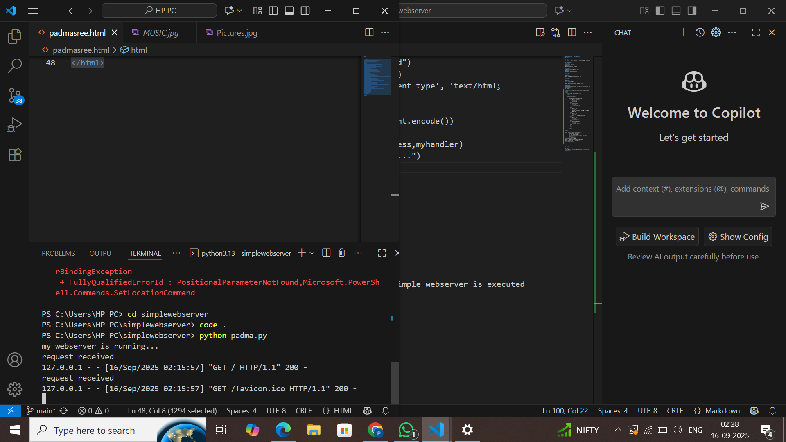
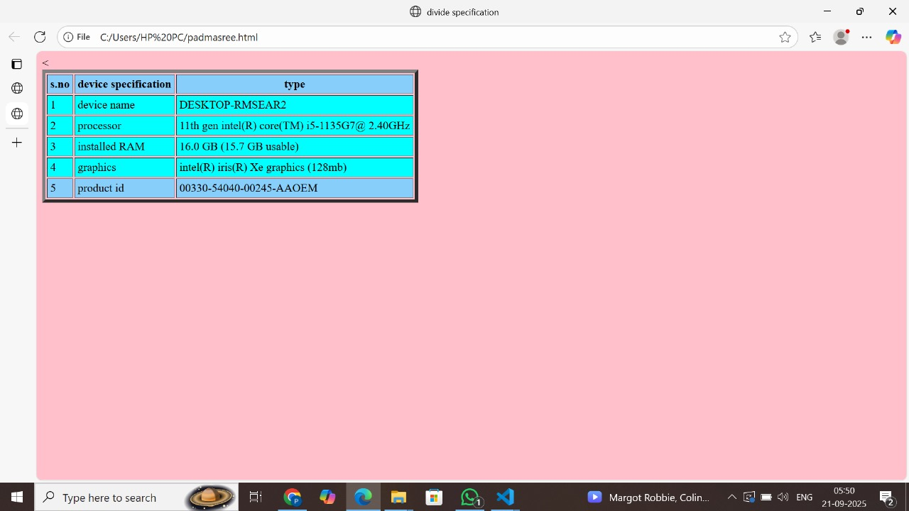

# EX01 Developing a Simple Webserver
## Date:`16.09.2025

## AIM:
To develop a simple webserver to serve html pages and display the Device Specifications of your Laptop.

## DESIGN STEPS:
### Step 1: 
HTML content creation.

### Step 2:
Design of webserver workflow.

### Step 3:
Implementation using Python code.

### Step 4:
Import the necessary modules.

### Step 5:
Define a custom request handler.

### Step 6:
Start an HTTP server on a specific port.

### Step 7:
Run the Python script to serve web pages.

### Step 8:
Serve the HTML pages.

### Step 9:
Start the server script and check for errors.

### Step 10:
Open a browser and navigate to http://127.0.0.1:8000 (or the assigned port).

## PROGRAM:
...
from http.server import HTTPServer, BaseHTTPRequestHandler
content = """
<!DOCTYPE html>
<head>
    <title>divide specification</title>
</head>
    
    <body bgcolor="pink">
    
        
        <table border="5" cellpadding="4" >
            <tr bgcolor="#87CEFA">
                <th>s.no</th>
                <th>device specification</th>
                <th>type</th>
            </tr>
            <tr bgcolor="cyan">
                <td>1</td>
                <td>device name</td>
                <td>DESKTOP-RMSEAR2</td>
            
            </tr>
            <tr bgcolor="cyan">
                <td>2</td>
                <td>processor</td>
                <td>11th gen intel(R) core(TM) i5-1135G7@ 2.40GHz</td>
            </tr>
            <tr bgcolor="cyan">
                <td>3</td>
                <td>installed RAM</td>
                <td>16.0 GB (15.7 GB usable)</td>
            </tr>
            <tr bgcolor="cyan">
                <td>4</td>
                <td>graphics</td>
                <td>intel(R) iris(R) Xe graphics (128mb)</td>
            </tr>
            <tr bgcolor="#87CEFA">
                <td>5</td>
                <td>product id</td>
                <td>00330-54040-00245-AAOEM</td>
            </tr>
            <    
            </tr>
            
        </table>
    </body>

</html>
"""
class myhandler(BaseHTTPRequestHandler):
    def do_GET(self):
        print("request received")
        self.send_response(200)
        self.send_header('content-type', 'text/html; charset=utf-8')
        self.end_headers()
        self.wfile.write(content.encode())
server_address = ('',8000)
httpd = HTTPServer(server_address,myhandler)
print("my webserver is running...")
httpd.serve_forever()

...

## OUTPUT:

## RESULT:
The program for implementing simple webserver is executed successfully.
